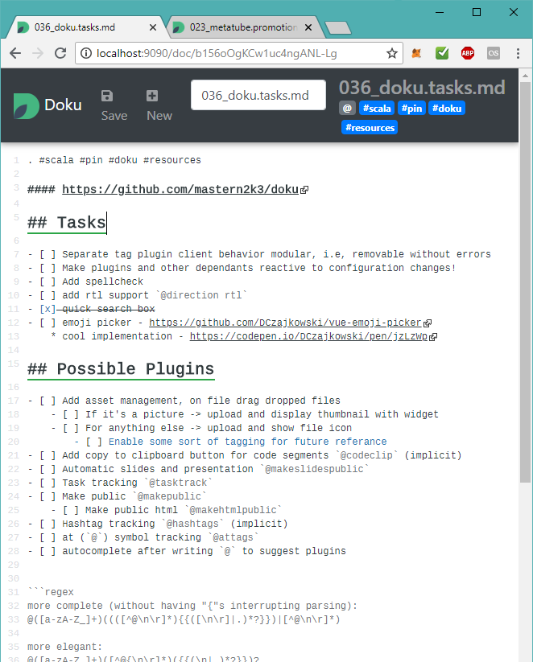

======

> A simple app that provides easy editing searching and linking of personal markdown files.

## Features

* **Markdown** - Designed to present Markdown in a tidy way.
* **Tags** - Organize and search documents using inline hashtags.
* **Local Folder**

## Planned

* **Task Tracking** - Curate and track Markdown task lists (`- [ ] read Scala cookbook`) that appear throughout your documents.
* **Cloud Integration** - Edit documents from your private cloud file storage like Dropbox or Google Docs.

## Screenshot

